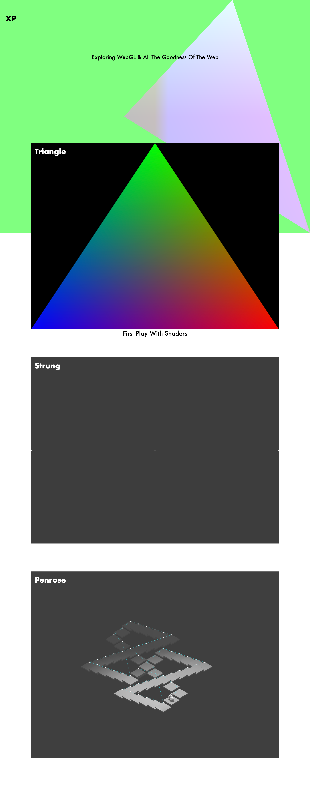

# XP Lab

## Motivation

A space for experimentation with WebGL, GLSL, Browser API's and JavaScript Tooling.
The goal is to mature to a workflow that offers flexibility and speed, with the dev experience in mind.

**Quick Start**

Clone the repo and `npm install && npm start`

**Extending The Virtual Gallery Space**

Create a new directory in src/ and add the metadata to the `src/xp.json`. On your next build, the new experiment will be transpiled and have a preview rendered by `puppeteer` for the gallery landing.

Repeat.

To visit your experiment, click on the image tile in the browser.

Preview:

